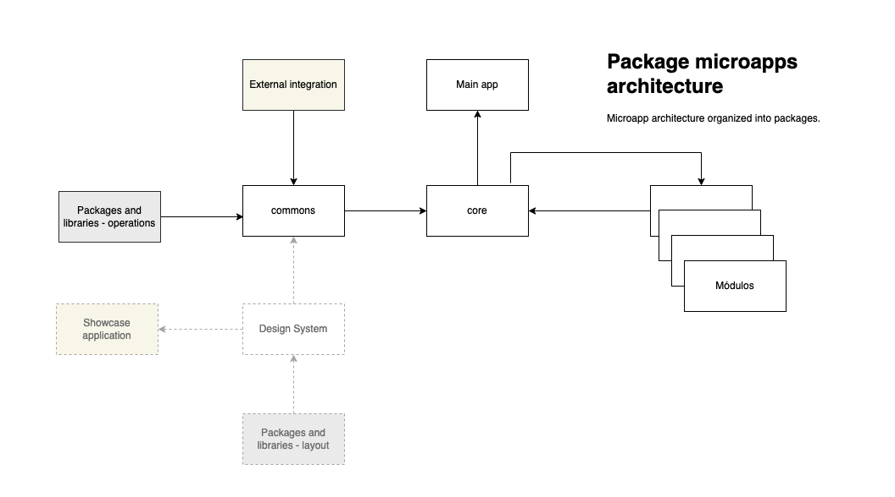
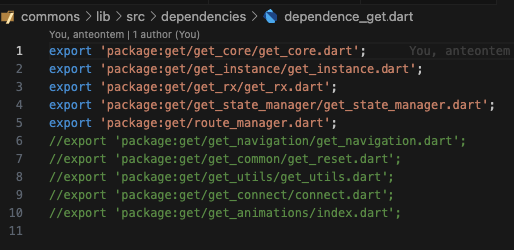

# Flutter microfrontend structure with getx limited

### Objetivo

O objetivo do projeto é criar a base de uma aplicação Flutter escalável e modular, onde diferentes funcionalidades são separadas em módulos distintos (microfrontends). Isso facilita a manutenção, o desenvolvimento paralelo e a reutilização de código.

A finalidade é demonstrar um ponto de partida para aplicações escaláveis, com componentes reutilizáveis, manuteníveis e com desenvolvimento paralelo por várias equipes.

A partir dela você pode decidir qual arquitetura usar, seja ela MVVM, MVC, ou mesmo baseada em Clena Architecture.

### Estrutura de Microfrontends

Microfrontends é uma abordagem arquitetônica para o desenvolvimento de interfaces de usuário (UI) onde uma aplicação é dividida em pequenos aplicativos independentes, cada um responsável por parte específica da aplicação, podendo ser granularizada por funcionalidades únicas ou por um conjunto de funcionalidades agrupadas sob um contexto de negócio. Esses pequenos aplicativos, chamados de microfrontends, ou microapps, são desenvolvidos, testados e implantados de forma independente, mas funcionam juntos como uma única aplicação coesa.

### Benefícios dos Microfrontends

1. **Escalabilidade** : Permite que diferentes equipes trabalhem em diferentes partes da aplicação simultaneamente, sem interferir umas nas outras.
2. **Manutenibilidade** : Facilita a manutenção e atualização de partes específicas da aplicação sem a necessidade de modificar o sistema inteiro.
3. **Reutilização de Código** : Componentes e funcionalidades podem ser reutilizados em diferentes partes da aplicação ou em diferentes projetos.
4. **Tecnologias Independentes** : Cada microfrontend pode ser desenvolvido usando diferentes tecnologias e e bibliotecas, permitindo a escolha da melhor ferramenta para cada caso específico.
5. **Desenvolvimento Paralelo** : Equipes podem trabalhar de forma paralela em diferentes microfrontends, acelerando o tempo de desenvolvimento.
6. **Implantação Independente** : Cada microfrontend pode ser implantado de forma independente, reduzindo o risco de falhas e facilitando o rollback em caso de problemas.

### Monorepositório e multipopositório

Existem duas vertentes de configuração de repositórios neste tipo de aplicação, monorepositório e multipositório.

**monorepositório** armazena todo o código-fonte de todos os microfrontends em um único repositório de controle de versão. Isso inclui todos os componentes, bibliotecas compartilhadas, ferramentas de build e scripts de automação.

**multirepositório** armazena cada microfrontend em seu próprio repositório de controle de versão. Cada microfrontend é gerenciado de forma independente, com seu próprio histórico de versões e dependências.

Cada abordagem tem suas vantagens e desvantagens. Uma breve pesquisa na Internet é possível encontrar um vasto material sobre vantagens e desvantagens destas duas vertentes.

### Estrutura do Projeto

Este projeto em Flutter utiliza um único repositório (monorepo), apesar de conter módulos de negócio independentes em packages isolados para que possam ser executados independentemente ontendo apenas a estrutura base juntamente com o módulo.

Esta é a estrutura do projeto:

* **commons** : Contém código e recursos compartilhados entre diferentes módulos, e que não faça parte especificamente do negócio, podendo ser utilizadado em qualquer projeto. Podemos citar algumas.
  * Dependências de bibliotecas de terceiros.
  * Configurações de integrações externas.
  * Providers de acesso a dados.
  * Wrappers de dependências externas.
  * Configurações de de acesso a Design System.
* **core** : Contém a lógica central e serviços essenciais da aplicação. Toda lógica de que faça parte do negócio da aplicação e que seja compartilhada entre os módulos. Podemos citar algumas.
  * Configurações de dependência dos módulos.
  * Carga de bindings de dependências compartilhadas
  * Carga de rotas de acesso às funcionalidades dos módulos
  * Classes de negócio compartilhadas
  * Interfaces UI compartilhadas.
* **modules** : Contém diferentes funcionalidades da aplicação, cada uma em seu próprio subdiretório. Estas funcionalidades devem ser totalmente isoladas em seus módulos, sem acesso direto por outros módulos, com acesso apenas através de rotas carregadas no core.
* **main** : Diretório principal, contendo a aplicação principal com com inicialização de ambientes, inicialização da aplicação, definindo uma rota inicial, configuração nativas e de flavors e schemes das plataformas.

A estrutura ainda poderia conter um design system, acoplado ao commons e exposto a todos os módulos para a utilização dos componentes.

### Recursos usados no projeto

**Melos**

Melos é uma ferramenta de gerenciamento de pacotes para projetos Flutter e Dart que facilita o gerenciamento de múltiplos pacotes dentro de um monorepo. Ele permite executar comandos em todos os pacotes, gerenciar dependências, versionamento e publicação de pacotes de forma eficiente. Melos é especialmente útil para grandes projetos que contêm vários pacotes interdependentes, ajudando a manter a consistência e simplificando o fluxo de trabalho de desenvolvimento.

[https://melos.invertase.dev/]([https://melos.invertase.dev)

**Estrutura de rotas, gestão de dependências e gestão de estado**

Apesar de ser uma tecnologia relativamente nova, o Flutter é extremamente versátil quanto a recursos que poderiam ser utilizados nos aplicativos. Até mesmo a arquitetura a ser utilizada pode ser um dilema, mesmo aos mais experiêntes.

Somente muito recentemente, na versão 3.27, o Google optou por recomendar a arquitetura MVVM paara o desenvolviento dos projetos, causando muita polêmica no mercado que já vinha adotando amplamente a base de Clean Architecture.

Quanto ao uso de packages, definir qual usar pode ser uma tarefa de decisão, devida à quantidade de opções que servem a um mesmo propósito.

Em projetos mais complexos, três recursos são básicos para promover escalabilidade, manutenibilidade e performance:

* Roteamento e navegação
  * Permite acessar as funcionalidades, seja em projetos distribuídos ou não.
* Injeção de dependência
  * Permite a separação da parte visual e operacional, bem como a reutilização, facilitando a compreenção e manutenção do projeto.
* Gerenciamento de estado
  * Permite com que partes de uma tela reajam sem recria-la totalmente e também prover reatividade global entre partes da aplicação promovendo performance e verstilidade.

Todos estes recursos podem se iplementados nativamente no Flutter sem a necessidade de uso de packages de terceiros, porém, alguns packages melhoram e facilitam esta experiência encapsulando complexidades e extendendo recursos, facilitando o desenvolvimento e reuso.

Neste projeto optei por utilizar o [Getx](https://pub.dev/packages/get), que  amplamente adotado em projetos no mundo inteiro e que cobre muito bem os recursos  mensionados.

Apesar dele ser solução com várias finalidades, pode ser modularmente utilizado, importando apenas os recursos que pretende usar, otimizando assim seu projeto. Além do mais, as funcionalidades que ele promove podem ser substituídas por outros packages caso venham acontecer problemas continuidade ou má gestão do mesmo.

Eu optei por utilizar neste projeto apenas os recursos necessários para roteamento, gestão e estado.

O Getx também conta com bom gerenciamento de recursos usilizados no aplicativo, descartando instâncias e otimizando memória automaticamente, além de ter um gerenciamento de estado dos mais versáteis que já usei.

Alguns packages mais populares e nativos que substituiriam o Getx, caso opte por não usa-lo:

* Roteamento e navegação
  * Go_router, Auto_route, Beamer, Navigator (nativo)
* Injeçao de dependência
  * Get_it, provider, implementaçao nativa.
* gerenciamento de estado
  * Provider, Riverpod, Bloc, Redux, Mobx, Signal, ChangeNotifier/ValueNotifies (nativo), StreamBuilder(nativo), setState (nativo)

Para executar o aplicativo, verifique a versão do flutter utilizada e considere também estudar os recursos do Melos, que auxilia muito no gerenciamento dos módulos do projeto.

Versão do Flutter: 3.27.0

Versão do Dart: 3.6.0

Versão do Melos: 6.2.0
